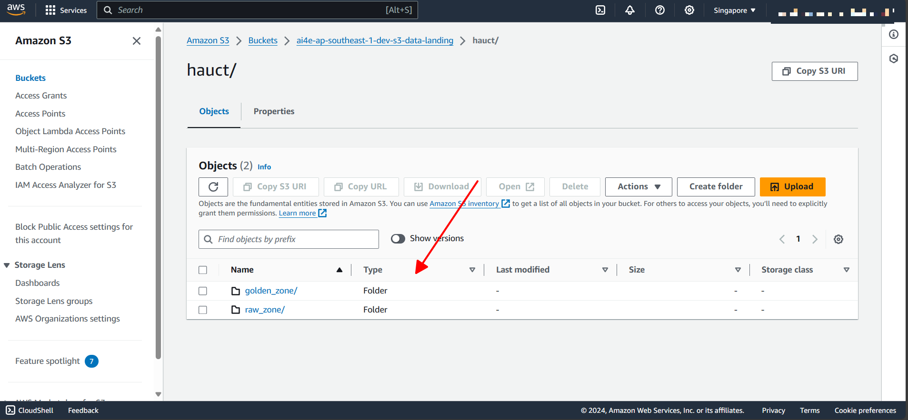
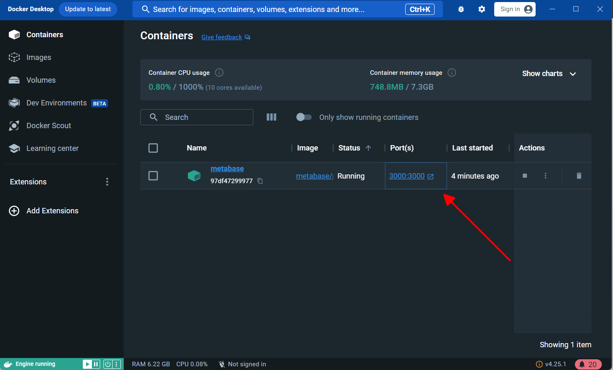

# Furniture Store data pipelines using AWS Cloud  - Data Engineering Project

## Table of Contents

- [Introduction](#introduction)
- [System Architecture](#system-architecture)
- [System Components](#system-components)
- [Walkthrough](#walkthrough)

## Introduction

My current project involves using `AWS Step Function` to automate a data processing workflow. This includes a simulation function that generates raw logs, mimicking the operations of a home appliance store. These logs are stored in `AWS S3`.

Then, `Glue Job PySpark` is used to transform these logs into dim/fact tables in AWS Athena. These tables are further transformed into insight tables using Glue Job PySpark, extracting valuable information from the raw data. `Crawler` is also added in order to get data from S3

Finally, `Metabase` is employed for data visualization, facilitating easier analysis and decision-making. In summary, this project leverages AWS and data analysis tools to create an efficient data processing system, thereby enhancing the business operations of the home appliance store.

## System Architecture


- **Step Function**: Automates the data processing workflow.
- **Glue Job**: Transforms and processes data.
- **S3**: Stores raw data.
- **Crawler**: Discovers and retrieves information from data.
- **Athena**: Queries and analyzes transformed data.

## Walkthrough

### Core codes

Before setting up a data pipeline, we need a data source. Here, I use the [`fake_data.py`](jobs/fake_data.py) function to generate daily records. These records form a table containing transaction information for a home goods store, specifically including the following columns:

- `Order_id`: Unique order identifier for each transaction.
- `Order_date`: The date the order was placed.
- `Ship_date`: The date the order was received, typically 3-4 days after the order date.
- `Cust_id`: Customer identifier for the order.
- `Cust_name`: Customer name, dependent on `cust_id`.
- `Birth_date`: Customer's date of birth, dependent on `cust_id`.
- `Phone`: Customer's phone number, dependent on `cust_id`.
- `Add_id`: Unique address identifier for the customer, unique per province, district, ward.
- `Province`: Customer's province, dependent on `add_id`.
- `District`: Customer's district, dependent on `add_id`.
- `Ward`: Customer's ward, dependent on `add_id`.
- `Ship_cost`: Shipping cost, dependent on `add_id`.
- `Prod_id`: Unique product identifier.
- `Category`: Product category, dependent on `prod_id`.
- `Sub_category`: Sub-category of the product, dependent on `prod_id`.
- `Prod_name`: Product name, dependent on `prod_id`.
- `Buy_price`: Purchase price, dependent on `prod_id`.
- `Sell_price`: Selling price, typically 1.4 times the `Buy_price`, dependent on `prod_id`.
- `Num_prd`: Quantity of product purchased.
- `Revenue`: Total revenue, calculated as `Sell_price * Num_prd`.
- `Discount`: Depreciation, one of the following values: 5%, 10%, 15%.
- `Profit`: Profit, calculated as `Revenue - (Discount * Revenue + Buy_price * Num_prd + Ship_cost)`.

** **
After obtaining the raw data, i will the [`load_data.py`](jobs/load_data.py) function use proceed to standardize it into dimension/fact tables, following the given entity-relationship diagram (ERD):


** **
Finally, the [`transform_data.py`](jobs/transform_data.py) script will help me extract and transform data from the dimension/fact tables to generate insight tables. These aim to answer some questions for end users:

- What are the daily trends for revenue, profit, costs, and purchase quantities?
- Which customer has made the highest value purchase?
- Which product yields the highest profit?

### Setting on AWS Cloud

You need to ensure you have an AWS Cloud account to carry out this project. You can refer to the registration process [here](https://repost.aws/knowledge-center/create-and-activate-aws-account). Once completed, you will have an account with a free tier for certain services for 12 months. The settings in this project have been calculated to be covered within this tier, so don’t worry about additional charges.

**IMPORTANT NOTE**: After creating your AWS account, you’ll have root access. However, it’s not recommended to use this for the project. Instead, create a new IAM account with appropriate permissions and nation (i used ap-southeast-1), such as full access to S3, Athena, Glue, and crawler.

**1. Create S3 folders:**

Before running a data pipeline on AWS Cloud, we need to create folders to store log files. On the S3 interface, I created a file storage path `s3://ai4e-ap-southeast-1-dev-s3-data-landing/hauct/`, which includes two sub-folders:

- `raw_zone`: This is where daily raw log files will be stored
- `golden_zone`: This is where dimension/fact tables and insight tables, calculated from the above tables, will be stored. Note that i create more sub-folder that represent the tables that we will need to store the data afterward.

| | |
|-|-|
|||

**2. Create Glue jobs:**

In the AWS Cloud Glue interface, create a new Glue job and edit the code according to the files in the jobs directory. You can customize the hardware configuration settings such as the Glue version, the number and type of workers, etc. After completion, we will have three Glue jobs as follows.

| | | |
|-|-|-|
||||


**3. Create Crawler:**

After creating the Glue jobs, we need a tool that will process new data as it appears and ingest it into the Athena database. Here, I will create a crawler named `ai4e-ap-southeast-1-dev-glue-cwl-golden_zone-cungtronghau_account_data`. Remember to  specify the data source to be the S3 paths in the `raw_zone` and `golden_zone` and set up appropriate IAM permissions.

| | |
|-|-|
|||
|||

**4. Create Step Function:**

Finally, we will create a step function to manage the flow of our data pipeline. Specifically, using the AWS Cloud step function interface, I created a state machine named `ai4e-ap-southeast-1-dev-cungtronghau`. Then, I dragged and dropped the appropriate icons corresponding to the processing steps. You can reference my process flow by copying [`step_function.json`](jobs/step_function.png) and pasting it into the Config section on the AWS Step Function interface.

| | |
|-|-|
|||

**5. Run Step Function and check the result:**

We initiate the Step function to start the data flow. Once the Step function completes after a while, we check the `raw_zone` and `golden_zone` directories in S3 for data. Additionally, we need to inspect Athena to see if the dim/fact tables have been created.

| | |
|-|-|
|||
|||

## Visualize on Metabase

Once we have sufficient data, the idea is to use Metabase to connect to the database and visualize the data, producing a report containing charts that provide insights for the end-user.

To save time, I recommend installing Metabase via Docker. First, download Docker Desktop. After installation, ensure Docker Desktop is running, open your code editor (for example, Visual Studio Code), open Terminal, and run the following command:

```bash
docker run -d -p 3000:3000 --name metabase metabase/metabase
```

After successfully pulling the Metabase image, we access port 3000:3000 to open the Metabase interface on the web.

| | |
|-|-|
|||

Proceed to register a Metabase account, ensuring you enter the correct information to connect to Amazon Athena, pointing to the data source. Then, create charts as needed. You can refer to my sample report in the following reports: [overview](report/Store%20Reports%20-%20Overview.pdf) and [indepth](report/Store%20Reports%20-%20Indepth.pdf).


**Addition note**: I also suggest an alternative approach where you retrieve data from the dim/fact tables and execute [`SQL`](sql) queries to create charts (instead of creating insight tables like profit_contribute, profit_customer, etc. on Athena). However, this method has a drawback: for large datasets, data processing dependent on Metabase may not be fast or optimal.

And this is also the end of my project. Thanks for watching.


